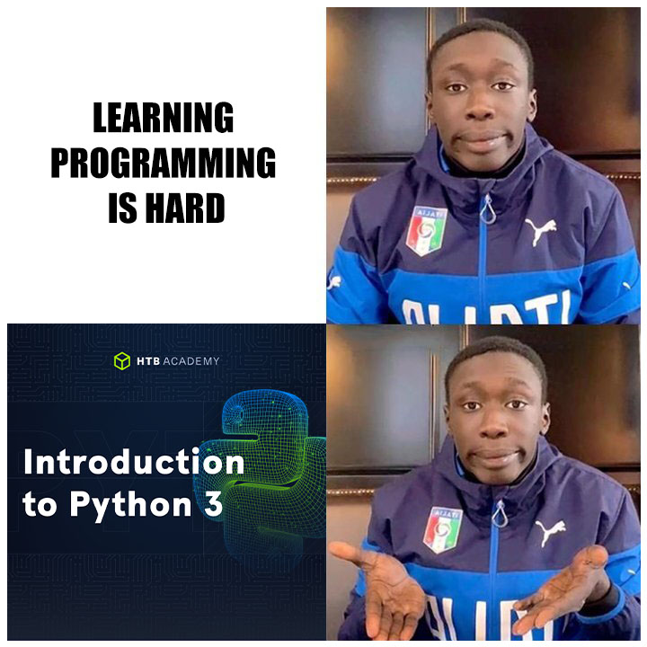

# Learning Python!

**Fun fact**  
- Pyhton wasn't named after the reptile but the “Monty Python's Flying Circus”, a BBC comedy series from the 1970s.
- In the python community, you're not only allowed to use references from the show, you're encouraged to.

<center></center>


## Getting started with **The Basics** 🔰
### Variables  
In Python, variables are used to store data in a computer.  
the general syntax of variables is:  
`identifier = value`  
Here are a few examples;  
 - customer = "Ochego"
 - product = "RasPi"
 - quantity = 4
 - price = 1500
 - weight = 2.5  

The syntax of the `value `differs with different **data types.**

### Data types  
There are several different data types in the Python language. They include;

#### 1. Strings(str)
>Strings are a sequence of a data, mostly consisting of text. When written in code, they are enclosed in "" or ''.  
For example, "Joseph", 'Learning', "ALX"

#### 2. Numeric Data Types
There are three numeric data types in Python:  
 **i) integers**(int): whole numbers e.g 5, 67, 2001,13009.  
  **ii) float**: these ones are made of fraction numbers e.g 15.5, 67.098.  
  **iii) complex**: an example of a complex number is 50j. The `j` implies the imaginary nature of the number.

#### 3. Boolean(bool)
The value of a boolean data type is usually either `True` or `False`.  

#### 4. Sequence types
Sequence data types are used to store a collection of data.  
The three sequence data types are;  

  - **Lists:** They store multiple items in a single variable. We use square brackets `[]`to denote the start and end f the lists.
  - **Tuples:** used to store multiple values within a single variable. The difference between this and lists is the use of parentheses `()` instead of square brackets.
  - **Range:** used to create a sequence of numbers.  
  `range(start,stop,step)`  

Python also has *Mapping* and *Set* types.

### Operators 
#### 1. Arithmetic Operators  
- `(+)` addition is used to add two numbers together  
- `(-)` subtraction is used to subtract two numbers together  
- `(*)` multiplication is used to multiply two numbers together  
- `(/)` division is used to divide two numbers together  
- `(%)` modulus is used to find the remainder of a division  
- `(**)` exponentiation is used to raise a number to a power  
- `(//)` floor division is used to find the floor of a division  

#### 2. Assignment operators
- `(=)` assignment is used to assign a value to a variable  
e.g  `age = 21`
- `(+=)` addition assignment is used to add a value to a variable
- `(-=)` subtraction assignment is used to subtract a value from a variable  

#### 3. Comparison operators
These operators are used to compare two values.  
They include ==, !=, <, >, <=, >=.  

#### 4. Logical operators
- `(and)` is used to check if two conditions are true  
- `(or)` is used to check if one of two conditions is true  
- `(not)` is used to check if a condition is false  

#### 5. Identity operators
- `(is)` is used to check if two variables are the same  
- `(is not)` is used to check if two variables are not the same 

### The *print* statement  
`print` is used to display values to the user.  
The items to be displayed are contained in parentheses `()`, hence the syntax of the statement is:  
`print()`  

For example:  
````python
  age = 21  
  print(age)

  #output:
  21
````
<br>
These are a few of the key concepts needed when getting started in learning Python.