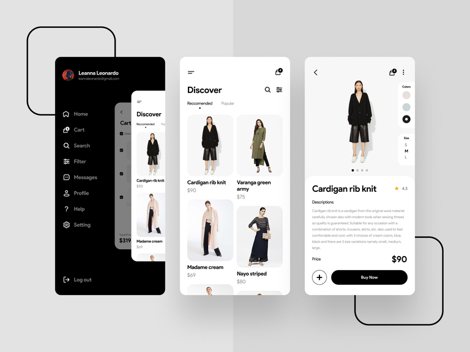

# Daily Outfit Recommendation App.

## Overview 
Do you wake up in the morning and on top of the morning routine you already have, you also have the added weight of choosing your outfit for the day?  
Well, not anymore.   

This app picks out a bunch of outfits, from stylish ones, to classy and official, based on your fashion taste and recommends them to you. Yours is to pick what the one you like and make it work for you.

## Index📃
1. [Installation](#installation)
2. [Setup and Usage](#setup-and-usage)
3. [Credits](#credits)

## Installation 📲
You can find the **Daily Outfit** app on Android from the Play Store or on the iPhone from the App Store.  

  

  

## Setup and Usage🤳
Make sure the installation of the app was successful.  
Open the app and setup your profile.   
Fill in your preferences and pick your fashion styles according to the examples given.

After setting up your account, you will be ready to receive daily outfit recommendations.  

To get your recommendation for the day, open the app and click on the day's date. This brings up several recommendations, based on different settings like official, classy, party or school.  

Click on the one you like. It lays out the outfit for you clearly and you make it work for you.

  

The app learns more about your preferences and improves suggestions over time based on your day-to day choices.  

***Make sure you dress to kill😉***

## Feedback
You can contribute to the improvement of this project by rating and giving feedback about your experience on the Play Store and App Store.  
Developers can also report any bugs or request to collaborate.  
You can communicate to us directly by writing to <support@dailyoutfit.com>

### Credits
This project could not have been possible without the contributions of🙏🏽:  
**🙂[@Platinum Queen](https://github.com/buyekeobare)**

___
State the licence used, if any. *(Used for major projects)*
